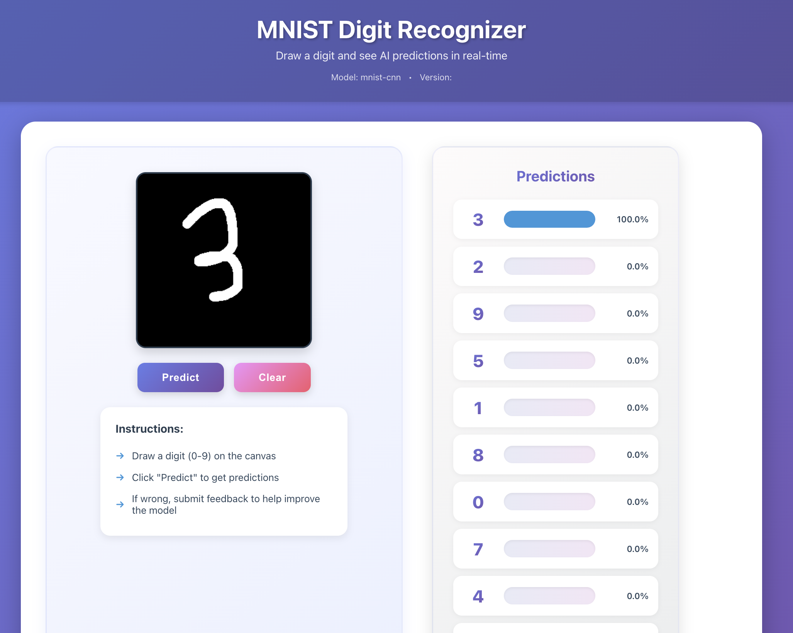

# MNIST Digit Recognition - MLOps Pipeline

A complete MLOps pipeline for MNIST digit recognition with automated model retraining, deployed on Google Cloud Platform (GCP) with a React frontend.

## Live Demo

- **Frontend (Vercel)**: https://frontend-mh7kjdw4p-shinhunjuns-projects.vercel.app
- **Backend API (Cloud Run)**: https://mnist-api-762303020827.us-central1.run.app

### Application Screenshot



The application features:
- **Interactive Drawing Canvas**: Draw digits (0-9) with your mouse or touch
- **Real-time Predictions**: Get instant predictions with confidence scores
- **Top Predictions Display**: See all 10 digits ranked by confidence percentage
- **Feedback System**: Submit corrections to improve the model
- **Modern UI**: Clean, gradient-based design with smooth animations

## Architecture Overview

```
┌─────────────────────────────────────────────────────────────────────┐
│                           User Interface                             │
│                    (React App on Vercel)                             │
│              - Draw digits on canvas                                 │
│              - View predictions                                      │
│              - Submit feedback                                       │
└───────────────────────────┬─────────────────────────────────────────┘
                            │
                            │ HTTPS
                            ▼
┌─────────────────────────────────────────────────────────────────────┐
│                     Backend API (FastAPI)                            │
│                  Deployed on Cloud Run                               │
│              - Handle prediction requests                            │
│              - Manage feedback collection                            │
│              - Trigger retraining workflow                           │
└─────┬───────────────────────────┬───────────────────────────────────┘
      │                           │
      │ Load Model                │ Store Feedback
      ▼                           ▼
┌──────────────────────┐    ┌──────────────────────┐
│   Vertex AI Model    │    │   Google Cloud       │
│      Registry        │    │      Storage         │
│  - mnist-cnn model   │    │  - Feedback data     │
│  - Versioned models  │    │  - Training datasets │
└──────┬───────────────┘    └──────┬───────────────┘
       │                           │
       │ Upload                    │ Download
       │ Trained Model             │ Training Data
       │                           │
       └───────────┬───────────────┘
                   │
                   ▼
       ┌────────────────────────┐
       │   GitHub Actions       │
       │  Automated Retraining  │
       │  - Triggered by API    │
       │  - Trains on new data  │
       │  - Uploads to Vertex   │
       └────────────────────────┘
```

## Project Structure

```
GithubAction_GCP_Docker/
├── frontend/                    # React frontend application
│   ├── src/
│   │   ├── components/
│   │   │   ├── DrawingCanvas.js        # Canvas for drawing digits
│   │   │   ├── PredictionDisplay.js    # Show prediction results
│   │   │   └── FeedbackForm.js         # Submit feedback
│   │   ├── App.js                      # Main application
│   │   └── App.css                     # Styling
│   └── package.json
│
├── backend/                     # FastAPI backend
│   ├── app/
│   │   └── main.py             # API endpoints
│   └── utils/
│       ├── model_loader.py     # Load model from Vertex AI
│       ├── gcs_storage.py      # GCS operations
│       └── github_trigger.py   # Trigger GitHub Actions
│
├── scripts/                     # Training and deployment scripts
│   ├── retrain_model.py        # Model retraining script
│   ├── upload_to_vertex_ai.py  # Upload model to Vertex AI
│   └── convert_model_to_savedmodel.py
│
├── .github/workflows/
│   └── retrain-model.yml       # GitHub Actions workflow
│
├── Dockerfile                   # Docker configuration for backend
└── requirements.txt            # Python dependencies
```

## Key Components

### 1. Frontend (React + Vercel)

**Technology Stack:**
- React.js
- HTML5 Canvas API
- Deployed on Vercel

**Features:**
- Interactive drawing canvas (280x280 pixels)
- Real-time digit prediction display
- Confidence scores for all 10 digits (0-9)
- Feedback submission system
- Responsive design with modern UI

**Environment Variables:**
```bash
REACT_APP_API_URL=https://mnist-api-762303020827.us-central1.run.app
```

**How to Access:**
Visit https://frontend-mh7kjdw4p-shinhunjuns-projects.vercel.app

### 2. Backend API (FastAPI + Cloud Run)

**Technology Stack:**
- FastAPI
- TensorFlow 2.15.0
- Google Cloud Run
- Docker

**API Endpoints:**

| Endpoint | Method | Description |
|----------|--------|-------------|
| `/` | GET | Health check |
| `/predict` | POST | Predict digit from image |
| `/feedback` | POST | Submit prediction feedback |

**Key Features:**
- Loads model from Vertex AI Model Registry
- Processes 28x28 grayscale images
- Stores feedback in Google Cloud Storage
- Triggers automated retraining when 100 feedback samples collected

**Model Loading:**
The backend uses TensorFlow SavedModel format and accesses predictions via model signatures:
```python
self.model = tf.saved_model.load(model_path)
infer = self.model.signatures.get('serving_default')
predictions = infer(input_tensor)
```

**Deployment:**
- Service: `mnist-api`
- Region: `us-central1`
- Container: Built from Dockerfile with multi-platform support (linux/amd64)

### 3. Google Cloud Storage (GCS)

**Bucket:** `mlops-mnist-data`

**Structure:**
```
mlops-mnist-data/
├── feedback/                    # User feedback data
│   ├── sub_set_0/
│   │   ├── 0_xxx.png
│   │   ├── 1_xxx.png
│   │   └── ...
│   ├── sub_set_1/
│   └── ...
│
└── models/                      # Trained models (uploaded to Vertex AI)
    ├── mnist-cnn-v1/
    ├── mnist-cnn-v2/
    └── ...
```

**Feedback Collection:**
- Images saved as PNG files (28x28 grayscale)
- Named format: `{predicted_label}_{actual_label}_{timestamp}.png`
- Organized into subset folders (sub_set_0, sub_set_1, etc.)
- Each subset triggers retraining when reaching 100 samples

### 4. Vertex AI Model Registry

**Model Details:**
- **Model Name:** `mnist-cnn`
- **Framework:** TensorFlow 2.15.0
- **Format:** SavedModel
- **Input:** (None, 28, 28, 1) - grayscale images
- **Output:** (None, 10) - probability distribution over digits 0-9

**Model Architecture:**
```
CNN Model:
- Conv2D(32, 3x3) + ReLU + MaxPool(2x2)
- Conv2D(64, 3x3) + ReLU + MaxPool(2x2)
- Flatten
- Dense(128) + ReLU + Dropout(0.5)
- Dense(10) + Softmax
```

**Model Versioning:**
- Each retraining creates a new version
- Versions are automatically managed by Vertex AI
- Backend always loads the latest version

**How Models are Uploaded:**
1. Model trained via GitHub Actions
2. Saved in SavedModel format
3. Uploaded to GCS temporarily
4. Registered in Vertex AI Model Registry
5. Available for Cloud Run to download and serve

### 5. GitHub Actions - Automated Retraining

**Workflow File:** `.github/workflows/retrain-model.yml`

**Triggers:**

1. **Automatic (repository_dispatch):**
   - Triggered by FastAPI when 100 feedback samples collected
   - Payload includes dataset version (e.g., `sub_set_5`)

2. **Manual (workflow_dispatch):**
   - Can be triggered manually from GitHub UI
   - Allows custom subset selection and epoch count

**Workflow Steps:**

1. **Setup Environment**
   - Ubuntu latest runner
   - Python 3.10
   - TensorFlow 2.15.0, Keras 2.15.0

2. **Authentication**
   - Uses service account key from GitHub Secrets
   - Secret name: `GCP_SA_KEY`

3. **Retrain Model**
   ```bash
   python scripts/retrain_model.py \
     --bucket=mlops-mnist-data \
     --subset=sub_set_X \
     --output-dir=./retrained_model \
     --epochs=5
   ```
   - Downloads feedback data from GCS
   - Combines with original MNIST training data
   - Trains model for 5 epochs
   - Saves in SavedModel format

4. **Upload to Vertex AI**
   ```bash
   python scripts/upload_to_vertex_ai.py \
     --project-id=mlops-compute-lab \
     --region=us-central1 \
     --model-name=mnist-cnn \
     --saved-model-dir=./retrained_model \
     --gcs-bucket=mlops-mnist-data
   ```
   - Uploads model to GCS
   - Registers new version in Vertex AI
   - Creates model with metadata

5. **Save Metadata**
   - Stores training metadata as GitHub artifact
   - Includes accuracy, loss, timestamp
   - Retained for 30 days

**Environment Variables:**
```yaml
GCP_PROJECT_ID: mlops-compute-lab
GCP_REGION: us-central1
GCS_BUCKET: mlops-mnist-data
MODEL_NAME: mnist-cnn
```

## Setup and Deployment

### Prerequisites

- Google Cloud Project with billing enabled
- GitHub account
- Vercel account
- Node.js 16+ and Python 3.10+

### 1. GCP Setup

```bash
# Set project
gcloud config set project mlops-compute-lab

# Create GCS bucket
gsutil mb -l us-central1 gs://mlops-mnist-data

# Create service account
gcloud iam service-accounts create mnist-service \
  --display-name="MNIST Service Account"

# Grant permissions
gcloud projects add-iam-policy-binding mlops-compute-lab \
  --member="serviceAccount:mnist-service@mlops-compute-lab.iam.gserviceaccount.com" \
  --role="roles/storage.admin"

gcloud projects add-iam-policy-binding mlops-compute-lab \
  --member="serviceAccount:mnist-service@mlops-compute-lab.iam.gserviceaccount.com" \
  --role="roles/aiplatform.user"

# Create key
gcloud iam service-accounts keys create key.json \
  --iam-account=mnist-service@mlops-compute-lab.iam.gserviceaccount.com
```

### 2. Backend Deployment to Cloud Run

```bash
# Navigate to project directory
cd GithubAction_GCP_Docker

# Build Docker image for Cloud Run (linux/amd64)
docker buildx build --platform linux/amd64 -t mnist-backend .

# Tag image
docker tag mnist-backend gcr.io/mlops-compute-lab/mnist-backend

# Push to Google Container Registry
docker push gcr.io/mlops-compute-lab/mnist-backend

# Deploy to Cloud Run
gcloud run deploy mnist-api \
  --image gcr.io/mlops-compute-lab/mnist-backend \
  --platform managed \
  --region us-central1 \
  --allow-unauthenticated \
  --memory 2Gi \
  --cpu 2 \
  --timeout 300 \
  --set-env-vars GCP_PROJECT_ID=mlops-compute-lab,GCS_BUCKET=mlops-mnist-data,MODEL_NAME=mnist-cnn,GCP_REGION=us-central1
```

### 3. Frontend Deployment to Vercel

```bash
# Navigate to frontend
cd frontend

# Install Vercel CLI
npm install -g vercel

# Login to Vercel
vercel login

# Add environment variable
vercel env add REACT_APP_API_URL production
# Enter: https://mnist-api-762303020827.us-central1.run.app

# Deploy to production
vercel --prod
```

### 4. GitHub Actions Setup

1. Go to GitHub repository settings
2. Navigate to Secrets and Variables > Actions
3. Add secret: `GCP_SA_KEY`
   - Value: Contents of the service account key JSON file

### 5. Initial Model Upload

```bash
# Train initial model
python scripts/retrain_model.py \
  --bucket=mlops-mnist-data \
  --subset=sub_set_0 \
  --output-dir=./initial_model \
  --epochs=5

# Upload to Vertex AI
python scripts/upload_to_vertex_ai.py \
  --project-id=mlops-compute-lab \
  --region=us-central1 \
  --model-name=mnist-cnn \
  --saved-model-dir=./initial_model \
  --gcs-bucket=mlops-mnist-data \
  --description="Initial MNIST model"
```

## How It Works - End to End Flow

### User Interaction Flow

1. **User draws a digit** on the canvas at the frontend
2. **Clicks "Predict"** button
3. Frontend converts canvas to 28x28 grayscale image
4. **POST request** sent to `/predict` endpoint on Cloud Run
5. Backend loads latest model from Vertex AI
6. Model returns probability distribution
7. **Predictions displayed** sorted by confidence
8. User can submit feedback via dropdown
9. **Feedback saved** to GCS in appropriate subset folder

### Automated Retraining Flow

1. **100 feedback samples** collected in a subset folder
2. Backend triggers GitHub Actions via `repository_dispatch`
3. **GitHub Actions workflow starts:**
   - Downloads feedback data from GCS
   - Combines with original MNIST data
   - Trains model for 5 epochs
   - Converts to SavedModel format
   - Uploads to Vertex AI Model Registry as new version
4. **New model available** for Cloud Run to load
5. Backend loads new model on next prediction request

## Testing

### Test Frontend Locally

```bash
cd frontend
npm install
npm start
# Visit http://localhost:3000
```

### Test Backend Locally

```bash
cd GithubAction_GCP_Docker
pip install -r requirements.txt
python -m uvicorn backend.app.main:app --reload
# Visit http://localhost:8000/docs for API documentation
```

### Test Prediction API

```bash
curl -X POST https://mnist-api-762303020827.us-central1.run.app/predict \
  -H "Content-Type: application/json" \
  -d '{"image": [[0.0, 0.0, ...], [...]], "flatten": false}'
```

### Test Manual Retraining

1. Go to GitHub repository
2. Click "Actions" tab
3. Select "Retrain MNIST Model" workflow
4. Click "Run workflow"
5. Enter subset ID (e.g., `sub_set_0`) and epochs
6. Click "Run workflow"

## Monitoring and Logs

### Cloud Run Logs

```bash
# View backend logs
gcloud run services logs read mnist-api --region=us-central1 --limit=50
```

### GitHub Actions Logs

- Go to repository > Actions tab
- Click on workflow run to view detailed logs

### Vertex AI Model Versions

```bash
# List model versions
gcloud ai models list --region=us-central1
```

### GCS Storage Usage

```bash
# List feedback files
gsutil ls -r gs://mlops-mnist-data/feedback/

# Count files in a subset
gsutil ls gs://mlops-mnist-data/feedback/sub_set_0/ | wc -l
```

## Cost Estimation (Monthly)

Based on typical usage:

- **Cloud Run**: ~$5-10 (100 predictions/day)
- **Cloud Storage**: ~$0.50 (1GB data)
- **Vertex AI Model Registry**: ~$3-5 (model storage)
- **GitHub Actions**: Free (2000 minutes/month included)
- **Vercel**: Free (Hobby plan)

**Total estimated cost: ~$10-20/month**

## Troubleshooting

### Frontend not connecting to backend

Check environment variable:
```bash
cd frontend
vercel env ls
# Ensure REACT_APP_API_URL is set to Cloud Run URL
```

### Backend failing to load model

Check Cloud Run environment variables:
```bash
gcloud run services describe mnist-api --region=us-central1 --format=yaml
```

### GitHub Actions workflow failing

1. Check service account permissions
2. Verify `GCP_SA_KEY` secret is set correctly
3. Check workflow logs for specific errors

### Model prediction errors

Ensure input image is:
- 28x28 pixels
- Grayscale (1 channel)
- Normalized to 0-1 range
- Shape: (batch_size, 28, 28, 1)

## Future Improvements

- [ ] Add model performance tracking dashboard
- [ ] Implement A/B testing for model versions
- [ ] Add data drift detection
- [ ] Implement model explainability (SHAP/LIME)
- [ ] Add user authentication
- [ ] Implement CI/CD for frontend
- [ ] Add comprehensive unit and integration tests
- [ ] Implement model monitoring and alerts

## Technologies Used

**Frontend:**
- React.js
- HTML5 Canvas
- Vercel

**Backend:**
- FastAPI
- TensorFlow 2.15.0
- Google Cloud Run
- Docker

**MLOps:**
- GitHub Actions
- Vertex AI Model Registry
- Google Cloud Storage

**Infrastructure:**
- Google Cloud Platform (GCP)
- Docker
- Nginx (for serving)

## License

MIT License

## Contact

For questions or issues, please open an issue in the GitHub repository.

---

**Built with MLOps best practices for continuous model improvement based on user feedback.**
